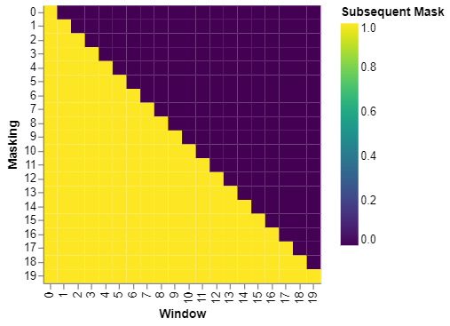
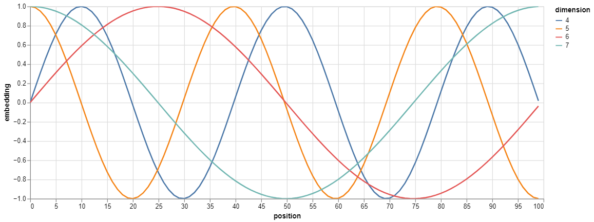
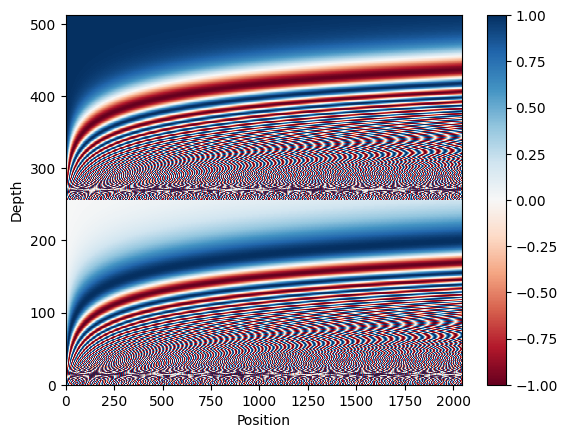

# **Introduction to the Transformer Model**
The Transformer model is a neural network architecture that was introduced in the paper ["Attention Is All You Need"](https://arxiv.org/abs/1706.03762). It was designed to address some of the limitations of previous sequence-to-sequence models such as recurrent neural networks (RNNs) and convolutional neural networks (CNNs).

The Transformer model uses a novel self-attention mechanism that allows it to process input sequences in parallel, rather than in a sequential manner like RNNs. This makes the model highly parallelizable and much faster than traditional sequence models.

Another key feature of the Transformer model is its ability to handle variable-length input sequences. Unlike RNNs, which require fixed-length sequences, the Transformer can handle sequences of any length by using positional encoding.

The Transformer has achieved state-of-the-art results on a wide range of natural language processing tasks such as machine translation, text summarization, and language modeling. Its success has led to its widespread adoption in the research community and industry.

In this repository, we provide an implementation of the Transformer model in PyTorch. **The implementation includes a class that simplifies the learning process, making it easy for users to understand**


## **Table of Contents**
  * [Model Architecture](#model-architecture)
    * [Encoder Decoder](#encoder-and-decoder-stacks) 
    * [Encoder](#encoder)
        * [LayerNorm](#layernorm)
        * [Residual connections](#residual-connections)
        * [Encoder Layer](#encode-layer)
        * [Position-wise Feed-Forward Networks](#position-wise-feed-forward-networks)
        * [Attention](#attention)
        * [Multi head attention](#multi-head-attention)
        * [Embedding](#embeddings-and-softmax)
        * [Posstion Encoding](#positional-encoding)
        * [Full Model](#full-model)
    * [Decoder](#decoder)
  * [Machine translation](#machine-translation)
  * [Setup](#setup)
  * [Usage](#usage)


## **Model Architecture**
Most competitive neural sequence transduction models have an
encoder-decoder structure
[(cite)](https://arxiv.org/abs/1409.0473). Here, the encoder maps an
input sequence of symbol representations $(x_1, ..., x_n)$ to a
sequence of continuous representations $\mathbf{z} = (z_1, ...,
z_n)$. Given $\mathbf{z}$, the decoder then generates an output
sequence $(y_1,...,y_m)$ of symbols one element at a time. At each
step the model is auto-regressive
[(cite)](https://arxiv.org/abs/1308.0850), consuming the previously
generated symbols as additional input when generating the next.

<br><br>

<br><br>

The Transformer follows this overall architecture using stacked
**self-attention** and **point-wise**, **fully connected layers** for both the encoder and decoder, shown in the left and right halves of Figure above, respectively.


### **Encoder and Decoder Stacks**
### **Encoder**

The encoder is composed of a stack of $N=6$ identical layers.

#### **LayerNorm**
<br><br>

<br><br>
We employ a residual connection
[(cite)](https://arxiv.org/abs/1512.03385) around each of the two
sub-layers, followed by layer normalization
[(cite)](https://arxiv.org/abs/1607.06450).

<br><br>

<br><br>

That is, the output of each sub-layer is $\mathrm{LayerNorm}(x +
\mathrm{Sublayer}(x))$, where $\mathrm{Sublayer}(x)$ is the function
implemented by the sub-layer itself.  We apply dropout
[(cite)](http://jmlr.org/papers/v15/srivastava14a.html) to the
output of each sub-layer, before it is added to the sub-layer input
and normalized.

To facilitate these **residual connections**, all sub-layers in the
model, as well as the embedding layers, produce outputs of dimension
$d_{\text{model}}=512$.

#### Residual connections
<br><br>

<br><br>

#### **Position-wise Feed-Forward Networks**

In addition to attention sub-layers, each of the layers in our
encoder and decoder contains a fully connected feed-forward network,
which is applied to each position separately and identically.  This
consists of two linear transformations with a ReLU activation in
between.

$$\mathrm{FFN}(x)=\max(0, xW_1 + b_1) W_2 + b_2$$

While the linear transformations are the same across different
positions, they use different parameters from layer to
layer. Another way of describing this is as two convolutions with
kernel size 1.  The dimensionality of input and output is
$d_{\text{model}}=512$, and the inner-layer has dimensionality
$d_{ff}=2048$.

#### **Self-Attention**
An attention function can be described as mapping a query and a set
of key-value pairs to an output, where the query, keys, values, and
output are all vectors.  The output is computed as a weighted sum of
the values, where the weight assigned to each value is computed by a
compatibility function of the query with the corresponding key.

We call our particular attention "Scaled Dot-Product Attention".
The input consists of queries and keys of dimension $d_k$, and
values of dimension $d_v$.  We compute the dot products of the query
with all keys, divide each by $\sqrt{d_k}$, and apply a softmax
function to obtain the weights on the values.


In practice, we compute the attention function on a set of queries
simultaneously, packed together into a matrix $Q$.  The keys and
values are also packed together into matrices $K$ and $V$.  We
compute the matrix of outputs as:

$$
   \mathrm{Attention}(Q, K, V) = \mathrm{softmax}(\frac{QK^T}{\sqrt{d_k}})V
$$


The two most commonly used attention functions are additive
attention [(cite)](https://arxiv.org/abs/1409.0473), and dot-product
(multiplicative) attention.  Dot-product attention is identical to
our algorithm, except for the scaling factor of
$\frac{1}{\sqrt{d_k}}$. Additive attention computes the
compatibility function using a feed-forward network with a single
hidden layer.  While the two are similar in theoretical complexity,
dot-product attention is much faster and more space-efficient in
practice, since it can be implemented using highly optimized matrix
multiplication code.


While for small values of $d_k$ the two mechanisms perform
similarly, additive attention outperforms dot product attention
without scaling for larger values of $d_k$
[(cite)](https://arxiv.org/abs/1703.03906). We suspect that for
large values of $d_k$, the dot products grow large in magnitude,
pushing the softmax function into regions where it has extremely
small gradients (To illustrate why the dot products get large,
assume that the components of $q$ and $k$ are independent random
variables with mean $0$ and variance $1$.  Then their dot product,
$q \cdot k = \sum_{i=1}^{d_k} q_ik_i$, has mean $0$ and variance
$d_k$.). To counteract this effect, we scale the dot products by
$\frac{1}{\sqrt{d_k}}$.

#### **Causal Self-Attention**
We also modify the self-attention sub-layer in the decoder stack to
prevent positions from attending to subsequent positions.  This
masking, combined with fact that the output embeddings are offset by
one position, ensures that the predictions for position $i$ can
depend only on the known outputs at positions less than $i$.

``` python 
def subsequent_mask(size):
    "Mask out subsequent positions."
    attn_shape = (1, size, size)
    subsequent_mask = torch.triu(torch.ones(attn_shape), diagonal=1).type(
        torch.uint8
    )
    return subsequent_mask == 0
```
<br><br>

<br><br>


#### **Multi head attention**


Multi-head attention allows the model to jointly attend to
information from different representation subspaces at different
positions. With a single attention head, averaging inhibits this.

$$
\mathrm{MultiHead}(Q, K, V) =
    \mathrm{Concat}(\mathrm{head_1}, ..., \mathrm{head_h})W^O \\
    \text{where}~\mathrm{head_i} = \mathrm{Attention}(QW^Q_i, KW^K_i, VW^V_i)
$$

Where the projections are parameter matrices $W^Q_i \in
\mathbb{R}^{d_{\text{model}} \times d_k}$, $W^K_i \in
\mathbb{R}^{d_{\text{model}} \times d_k}$, $W^V_i \in
\mathbb{R}^{d_{\text{model}} \times d_v}$ and $W^O \in
\mathbb{R}^{hd_v \times d_{\text{model}}}$.

In this work we employ $h=8$ parallel attention layers, or
heads. For each of these we use $d_k=d_v=d_{\text{model}}/h=64$. Due
to the reduced dimension of each head, the total computational cost
is similar to that of single-head attention with full
dimensionality.


#### **Embeddings and Softmax**

Similarly to other sequence transduction models, we use learned
embeddings to convert the input tokens and output tokens to vectors
of dimension $d_{\text{model}}$.  We also use the usual learned
linear transformation and softmax function to convert the decoder
output to predicted next-token probabilities.  In our model, we
share the same weight matrix between the two embedding layers and
the pre-softmax linear transformation, similar to
[(cite)](https://arxiv.org/abs/1608.05859). In the embedding layers,
we multiply those weights by $\sqrt{d_{\text{model}}}$.

#### **Positional Encoding**

Since our model contains no recurrence and no convolution, in order
for the model to make use of the order of the sequence, we must
inject some information about the relative or absolute position of
the tokens in the sequence.  To this end, we add "positional
encodings" to the input embeddings at the bottoms of the encoder and
decoder stacks.  The positional encodings have the same dimension
$d_{\text{model}}$ as the embeddings, so that the two can be summed.
There are many choices of positional encodings, learned and fixed
[(cite)](https://arxiv.org/pdf/1705.03122.pdf).

In this work, we use sine and cosine functions of different frequencies:

$$PE_{(pos,2i)} = \sin(pos / 10000^{2i/d_{\text{model}}})$$

$$PE_{(pos,2i+1)} = \cos(pos / 10000^{2i/d_{\text{model}}})$$

where $pos$ is the position and $i$ is the dimension.  That is, each
dimension of the positional encoding corresponds to a sinusoid.  The
wavelengths form a geometric progression from $2\pi$ to $10000 \cdot
2\pi$.  We chose this function because we hypothesized it would
allow the model to easily learn to attend by relative positions,
since for any fixed offset $k$, $PE_{pos+k}$ can be represented as a
linear function of $PE_{pos}$.

In addition, we apply dropout to the sums of the embeddings and the
positional encodings in both the encoder and decoder stacks.  For
the base model, we use a rate of $P_{drop}=0.1$.

<br><br>

<br><br>

<br><br>

<br><br>

<br><br>

<br><br>

#### Full Model
<br><br>

<br><br>